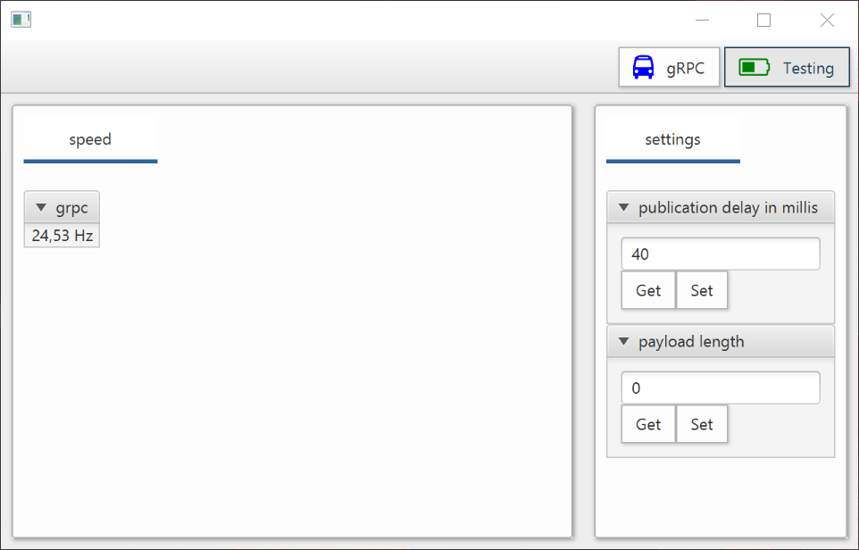

# client-server-demo

The purpose of this project is to compare and demonstrate different technologies for client-server communication 
for control system components.

### Getting started

The easiest way to get the demo working is to check out the actual project from this repository 
and using the included gradle wrapper to start client and server.

From within the top directory, start the server by:
```
./gradlew :demo-server:run
```

and to start the client (javafx gui), type:
```
./gradlew :demo-client:run
```

On a linux system, it you might have to first make the gradle wrapper script executable:
```
chmod a+x ./gradlew
```


### Pure REST

* No notification possible

Example Code for the RestController:
```java
// Fro gets
@GetMapping("/standardDev")
public double getTuneStandardDev() {
// whatsoever
}

// for posts
@PostMapping("/standardDev/{stdDev}")
public void setTuneStandardDev(@PathVariable("stdDev") double stdDev) {
    //whatsoever
}
```

Simplistic java client code (using spring 5 web client):

```java
private final WebClient client = WebClient.create("http://" + BASE_URI);

// getting from the server
public double getStandardDev() {
    return client.get()
        .uri("/standardDev")
        .retrieve()
        .bodyToMono(Double.class)
        .block();
}

// setting to the server (through POST)
@Override
public void setStandardDev(double standardDev) {
    client.post()
       .uri("/standardDev/" + standardDev)
       .exchange()
       .block();
}

```

Example Client code in javascript (using jquery):
```javascript
$.get("http://" + location.host + "/standardDev", msg => {
		console.log(msg);
    });
```

### Spring Webflux

[Server-Sent events](https://en.wikipedia.org/wiki/Server-sent_events) (specification [here](https://www.w3.org/TR/eventsource)) seem to be very useful for many applications: 
* Works nicely out of the box. The browser shows some nice updates immediately.
* Easy for variable number of endpoints
* Seems to reconnect automatically in javascript (not in java!?)

A RestController method in spring would look somehow like this:
```java
@GetMapping(value = "/measuredTunes", produces = MediaType.TEXT_EVENT_STREAM_VALUE)
public Flux<Tune> measuredTunes() {
    // whatever here
}
```

Simplistic (neglecting error handling, stream sharing etc) client code in Java:
```java

 private final WebClient client = WebClient.create("http://" + BASE_URI);

 public Flux<Tune> measuredTunes() {
     return client.get()
           .uri("/measuredTunes")
           .retrieve()
           .bodyToFlux(Tune.class);
 }
```

The client code in javascript:
```javascript
var source = new EventSource("http://" + location.host + "/measuredTunes");
source.onmessage = e => {
    console.log(e.data);
};
```

Open Questions:
* High data rates?

### Websockets

* Good for high data rates
* Endpoints to be known on startup
* Do not reconnect automatically.
* Some more in formation for when to use can be found in the [spring docs](https://docs.spring.io/spring/docs/5.0.0.BUILD-SNAPSHOT/spring-framework-reference/html/websocket.html#websocket-intro-when-to-use).

Spring server configuration:
[WebSocketConfiguration.java](demo-server/src/main/java/io/github/kaifox/gsi/demo/mains/restws/restws/components/WebSocketConfiguration.java)

Java Client Code
```java
 @Override
    public Flux<Tune> wsMeasuredTunes() {
        StringFluxWsHandler handler = new StringFluxWsHandler();
        wsClient.doHandshake(handler, "ws://" + BASE_URI + "/ws/measuredTunes");
        // set message size limits to 1 MB ?
        return handler.flux()
                .map(v -> defaultDeserialization(v, Tune.class));
    }
    
    private class StringFluxWsHandler extends TextWebSocketHandler {
            private final ReplayProcessor<String> sink = ReplayProcessor.cacheLast();
            private final Flux<String> stream = sink.publishOn(Schedulers.elastic());
    
            public Flux<String> flux() {
                return this.stream;
            }
    
            @Override
            protected void handleTextMessage(WebSocketSession session, TextMessage message) throws Exception {
                sink.onNext(message.getPayload());
            }
        }
``` 

Client Code in JavaScript:
```javascript
var wsTune = new WebSocket("ws://"+location.host+"/ws/measuredTunes");
wsTune.onmessage = (msg) => {
    console.log(msg.data);
}
```

### gRPC

WIP

Notes to get started with gRPC development: 
[grpc-develop.md](demo-server/grpc/grpc-develop.md)

## Performance comparison

The demo project contains some simple utilities to probe the transportation capabilities of the different technologies.
There exist dedicated endpoints (and some panel in the client) to tune some parameters of publications:

* `delayInMillis`: this is the delay in milliseconds between two publications of a tune item.
* `payloadLength`: In addition to the tune value and error, the transported tune object contains an additional list of
double values, which can be of variable length.

Using this input parameters, then the publication frequency on the client is calculated and displayed. 

Here is a screenshot of the javafx-gui showing this testing view:


In the following table, we assume a requested update rate. Then, as a quick check,
we tuned up the payload size and look when the requested speed cannot be maintained on the client side (breakdown). 
The streams on the server of the demo application are configured to drop in case of backpressure, so we will loose
updates in this case.

The following table shows the approximate payload lengths, where the demanded publication freq is slowed down by 25%.

| Tech       | 25 Hz demand | 10 Hz demand  | 4 Hz demand  |  
| ----       | ------------ | ------------- | -----------  | 
| gRPC       | &tilde; 400k | &tilde; 400k  | &tilde; 1M | 
| Websockets | &tilde; 65k  | &tilde; 160k  | &tilde; 400k |
| Webflux    | &tilde; 55k  | &tilde; 140k  | &tilde; 350k |

**DISCLAIMER**
> These tests were done on a setup with both, client and server running on the same machine.
> No tuning or optimization on any of the technologies was done. 
> This tests represent more or less a quite naive implementation. 
> Due to these restrictions, the absolute numbers might not be fully valuable.
> However, as a comparision between these technologies, we consider them still valuable. 

**Test Setup:**
* Acer Predator G9-791
* [Intel Core i7-6700HQ CPU @ 2.60 GHz](https://en.wikichip.org/wiki/intel/core_i7/i7-6700hq) (4 Cores, 7 Threads)
* 64.0 GB RAM

In summary, gRPC clearly is performing better for big data loads. Webflux and Websockets are very similar within 
the accuracy of this 'measurement';

As a complementary measurement, we looked at small packages only (`payloadLength=0`), and scanned the publication 
frequency space.

The resulting calculations can be found [here](https://docs.google.com/spreadsheets/d/1rSFsTiP91ELiCHMhHRgf9pQ7i40eltpZvTUX4zcZN_Q/edit?usp=sharing).
As a summary: All the three technologies (in the given setup) seem to perform very similar. 
The reduction in update frequency seems to be mainly dominated by some constant overhead per publication (0.2ms), 
which of course is more visible at higher update rates. 


### ossgang-properties

* combines REST + websockets.
* particularly useful when setable and getable
* Potentially an interesting combination could be REST + SSE.


#### Criteria to decide what to use

* Integrierbarkeit (how well does it fit in the landscape)
* Language agnostic?
* Handhabbarkeit?
* Speed?

Also to be discussed with Hanno

#### Other links


